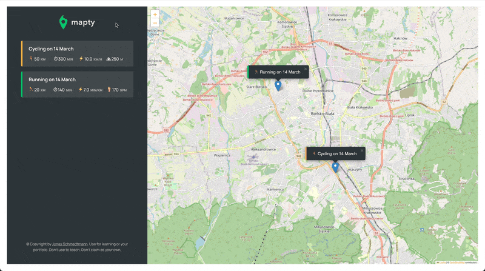

<a id="readme-top"></a>

<p align="center">
  <br>
 </a>
</p>

<h4 align="center">Mapty was created as part of the Selleo project on Mondays dojo at Karbowa str.<br /> Website was developed using JavaScript classes Handlebars template and Leaflet library.</h4>

<p align="center">
  <a href="#demo">Demo</a> •
  <a href="#overview">Quick overview</a> •
  <a href="#languages">Languages&Tools</a> •
  <a href="#how-to-use">How To Use</a> •
  <a href="#contact">Contact</a>
</p>

<br />

<p align="center">
  
<p>

## 💻 <a id="demo">Demo :</a>

If you want check jsMapty, it is deployed on Netlify. Just click link below :
<br />

https://candid-zabaione-fc5e44.netlify.app/

<p align="right">(<a href="#readme-top">back to top</a>)</p>

## 🚀 <a id="overview">Quick overview :</a>

The app was developed using JavaScript classes Handlebars template. Leaflet library was used to create an interactive map. The application uses local storage to save and download exercise data. After agreeing to track the user's location, the map will display area where user is located. After selecting a point on the map, a selecting form will be displayed. The user can choose one of the two available training options: running or cycling. Depending on the type of training, the last input will be replaced. Validation checks that the user has not left empty inputs and that the values ​​entered by him are integers. After submitting, a marker with basic training data will be displayed on the map and detailed training data will be displayed in the form. After clicking on a specific training in the form, the map will be centered on the corresponding marker.

<p align="right">(<a  href="#readme-top">back to top</a>)</p>

## 🛠️ <a id="languages">Languages & tools</a>

|                                                                   Language / Tool                                                                    | Description                                                                 |
| :--------------------------------------------------------------------------------------------------------------------------------------------------: | :-------------------------------------------------------------------------- |
|                                         | Language used for structuring and presenting content on the World Wide Web. |
|                                 | JavaScript library for interactive maps.                                    |
|                                          | CSS pre-procesor that make writing CSS more powerful.                       |
|  | To create dynamically updating content.                                     |
|                 | Library used to create reusable webpage templates in HTML document.         |
|                                          | Node Module that is used to create demo rest json webservice                |
|                                    | Helps you find and fix problems with your JavaScript code.                  |
|                           | Helps avoid errors and enforce conventions                                  |

<p align="right">(<a href="#readme-top">back to top</a>)</p>

## 💾 <a id="how-to-use">How To Use :</a>

```bash
# Clone this repository
$ git clone https://github.com/iMdPd/jsMapty.git

# Go into the repository
$ cd random/directory/jsMapty

# Install dependencies
$ npm install

# Run the app
$ npm run watch
```

<p align="right">(<a href="#readme-top">back to top</a>)</p>

## 🤙🏻 <a id="contact">Contact :</a>

> GitHub [@iMdPd](https://github.com/iMdPd)
